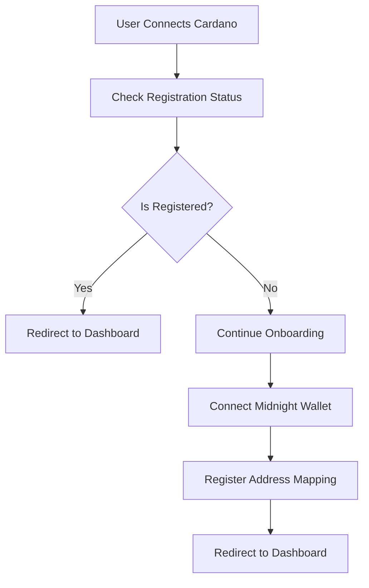

# Midnight NIGHT to DUST DApp

A sophisticated cross-chain decentralized application that enables seamless generation of DUST tokens on the Midnight network based on cNIGHT token holdings on Cardano.

## Architecture

### Technology Stack
- **Frontend**: Next.js 15 with App Router and Turbopack
- **UI Framework**: HeroUI with Tailwind CSS 4.x
- **Type Safety**: TypeScript throughout the application
- **Blockchain Integration**:
  - Cardano: Lucid Evolution for transaction building
  - Midnight: Midnight SDK with shielded address support
- **State Management**: React Context for wallet and registration status
- **API Integration**: GraphQL subgraph integration with REST endpoints

### Dual-Wallet System
The application manages two distinct wallet ecosystems:

#### Cardano Wallets
- **Supported**: Nami, Eternl, Lace, Flint, Typhon, Nufi, Gero, CCVault
- **Purpose**: cNIGHT token holdings and transaction signing
- **Network**: Cardano Preview testnet with Blockfrost API
- **Features**: UTXO management, balance calculation, auto-reconnection

#### Midnight Wallets
- **Supported**: mnLace (Midnight Lace extension)
- **Purpose**: DUST token generation and privacy operations
- **Features**: Shielded addresses, privacy-preserving transactions
- **Integration**: Client-side balance calculations, manual address input support

### Smart Registration Flow


## Development

### Prerequisites
- Node.js 18+
- Yarn 1.22.22 (specified in packageManager)
- Git

### Installation
```bash
# Clone the repository
git clone <repository-url>
cd midnight-cnight-to-dust-dapp

# Install dependencies
yarn install

# Start development server
yarn dev

# Build for production
yarn build

# Run linter
yarn lint
```

### Environment Setup
```bash
# Copy environment template
cp .env.example .env.local

# Configure required variables in .env.local
NEXT_PUBLIC_CARDANO_NET="Preview"

# Blockfrost API configuration
BLOCKFROST_KEY_MAINNET=your_mainnet_key
BLOCKFROST_KEY_PREVIEW=your_preview_key
BLOCKFROST_KEY_PREPROD=your_preprod_key

# Simulation mode (for development/testing)
SIMULATION_MODE=true
NEXT_PUBLIC_SIMULATION_MODE=true

# Server configuration
NEXT_PUBLIC_REACT_SERVER_BASEURL="http://localhost"
NEXT_PUBLIC_REACT_SERVER_URL="$NEXT_PUBLIC_REACT_SERVER_BASEURL:3000"
NEXT_PUBLIC_REACT_SERVER_API_URL="$NEXT_PUBLIC_REACT_SERVER_URL/api"

# cNIGHT token configuration
NEXT_PUBLIC_PREVIEW_CNIGHT_CURRENCY_POLICY_ID="fb3cec684bc96575f4ba6ed7f11b1547114d7af41a9f38e552bcfbd2"
```

### Simulation Mode
The application includes a simulation mode for development and testing without requiring a live indexer:

```bash
# Enable simulation mode in .env.local
SIMULATION_MODE=true
NEXT_PUBLIC_SIMULATION_MODE=true
```

When simulation mode is enabled:
- **API Endpoints**: `/api/dust/generation-status/[key]` returns mock data instead of querying the real indexer
- **Mock Response**: Provides realistic test data including stake key, dust address, registration status, and generation rate
- **Development Benefits**: Allows UI/UX testing without backend dependencies
- **QA Testing**: Enables consistent test scenarios for quality assurance

**Mock Data Structure**:
```json
{
  "success": true,
  "data": [{
    "cardanoStakeKey": "provided_stake_key",
    "dustAddress": "mn1qg5ks9wrqhwjv3k2g2h8mcq9wrqhwjv3k2g2h8mcq9wrqhwjv3k2g2h8mc",
    "isRegistered": true,
    "generationRate": "2.5"
  }]
}
```

When disabled (`SIMULATION_MODE=false`), the application queries the real GraphQL indexer endpoint for live data.

## Smart Contract Integration

The application integrates with the MIDNIGHT DUST smart contract system on Cardano, enabling users to link their Cardano wallets with Midnight addresses for DUST token generation. The system consists of 8 parameterized smart contracts that handle registration, versioning, and governance.

**Key Features:**
- **Dual-Chain Architecture**: Links Cardano wallet addresses to Midnight addresses
- **Parameterized Contracts**: Genesis UTxO ensures deployment uniqueness
- **User Registration**: Secure wallet-to-address mapping with auth tokens
- **Governance System**: Multi-signature governance for system upgrades
- **Version Oracle**: Upgradeable contract logic with versioning support

For complete smart contract integration details, transaction structures, and deployment steps, see the [**DAPP Integration Guide**](./DAPP_INTEGRATION_GUIDE.md).

## API Integration

### GraphQL Subgraph
The application integrates with a GraphQL subgraph for registration status queries:

```graphql
query GetDustGenerationStatus($cardanoStakeKeys: [String!]!) {
  dustGenerationStatus(cardanoStakeKeys: $cardanoStakeKeys) {
    cardanoStakeKey
    dustAddress
    isRegistered
    generationRate
  }
}
```

### REST Endpoints
- `GET /api/dust/generation-status/[key]` - Query specific stake key status

## Design System

### Custom Theme
The application uses a custom theme built on Tailwind CSS 4.x:

```css
@theme {
  --color-brand-primary: #0000FE;
  --color-brand-primary-hover: #0000CC;
}
```

Usage:
```jsx
<Button className="bg-brand-primary hover:bg-brand-primary-hover">
  Primary Action
</Button>
```

### Component Architecture
- **Reusable UI Components**: Toast notifications, loading backdrops, wallet cards
- **Context Providers**: Centralized wallet state and registration status management
- **Custom Hooks**: `useGenerationStatus`, `useToast` for business logic encapsulation

## Security & Privacy

### Privacy Considerations
- **Shielded Addresses**: Midnight integration uses privacy-preserving shielded addresses
- **Client-Side Operations**: Sensitive calculations performed client-side
- **No Server Storage**: No sensitive data stored on application servers
- **Wallet Security**: Standard CIP-30 and Midnight wallet security practices

### Network Configuration
- **Cardano**: Preview testnet for development and testing
- **Midnight**: Testnet integration with privacy features
- **WebAssembly**: Configured for cryptographic operations

## User Flows

### Registration Flow
1. **Landing Page**: User views application overview
2. **Cardano Connection**: Connect CIP-30 compatible wallet
3. **Registration Check**: Automatic query for existing registration
4. **Midnight Setup**: Connect Midnight wallet or input address manually
5. **Address Mapping**: Register mapping via smart contract
6. **Dashboard Access**: View generation status and manage settings

### Dashboard Features
- **Wallet Cards**: Display connected wallet information with copy functionality
- **Generation Metrics**: Real-time DUST generation rates and totals
- **Address Management**: Update or disconnect wallet connections
- **Action Buttons**: Change addresses, stop generation, manage settings

## Contributing

### Development Guidelines
- **Code Style**: ESLint with Next.js configuration
- **Type Safety**: Strict TypeScript enforcement
- **Component Structure**: Follow established patterns in `/src/components`
- **State Management**: Use provided contexts for wallet and registration state

### Commit Convention
- `feat:` New features
- `fix:` Bug fixes
- `docs:` Documentation updates
- `style:` Code style changes
- `refactor:` Code refactoring
- `test:` Test additions or updates

---

**Status**: 🚧 Active Development

This application is under continuous development with regular updates and improvements.